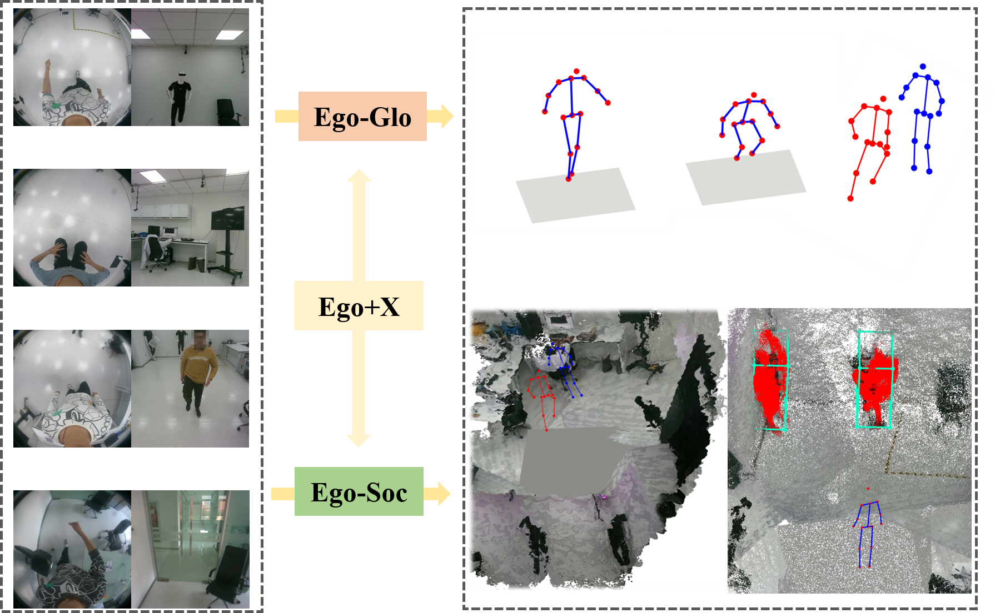

# Ego+X
[**IROS 2022**] Repo for our paper "**Ego+X: An Egocentric Vision System for Global 3D Human Pose Estimation and Social Interaction Characterization**" 

[[paper](https://ieeexplore.ieee.org/abstract/document/9981710)]

<p align="center"></p>

## Abstract
We propose Ego+X, an egocentric vision based system for 3D canonical pose estimation and human-centric social interaction characterization. Our system is composed of two head-mounted egocentric cameras, where one is faced downwards and the other looks outwards. By leveraging the global context provided by visual SLAM, we first propose
Ego-Glo for spatial-accurate and temporal-consistent egocentric 3D pose estimation in the canonical coordinate system. With the help of an egocentric camera looking outwards, we then propose Ego-Soc by extending Ego-Glo to various social interaction tasks, e.g., object detection and human-human interaction.

## Contributions
1) An egocentric vision system consisting of two cameras looking downwards and outwards respectively is proposed for social interaction characterization. Its capability in various downstream tasks is demonstrated.
2) An effective framework for 3D canonical pose estimation from an egocentric fisheye camera is developed, in which a pose refine module is proposed to improve the estimation in both temporal and spatial domains.

<p align="center"></p>

## Brief Introduction
  <video><source id="mp4" src="misc/IROS_2022_VIDEO_final.mp4" type="video/mp4"></video>


## Citation
If you find our paper/dataset/code useful, please consider citing:
```bibtex
@INPROCEEDINGS{liu2022Egox,
  author={Liu, Yuxuan and Yang, Jianxin and Gu, Xiao and Guo, Yao and Yang, Guang-Zhong},
  booktitle={2022 IEEE/RSJ International Conference on Intelligent Robots and Systems (IROS)}, 
  title={Ego+X: An Egocentric Vision System for Global 3D Human Pose Estimation and Social Interaction Characterization}, 
  year={2022},
  volume={},
  number={},
  pages={5271-5277},
  doi={10.1109/IROS47612.2022.9981710}}
```
